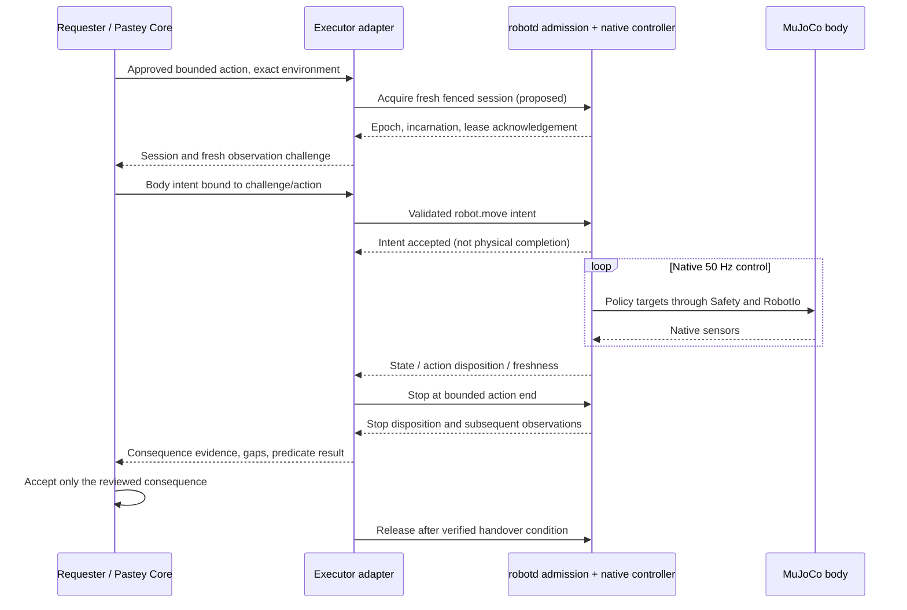

# MicroDuck Environment integration for Pastey 2.0

Status: proposed architecture; no adapter, runtime changes, or hardware qualification implemented by this document.

Research date: 2026-09-26. Source baseline: Pastey `6d44e544ff06cc63074245996eed36162a51b95f`; MicroDuck `a9ec4b2079ef8ee7904014089c885bb07d57d63c`; microduck_rl `cb70b792312d559a4da09064d92009079671815f`. Revision-pinned source references appear at the end. “Current” below means these inspected revisions. Proposed interfaces and states are design requirements, not existing APIs.

## 1. Goal and non-goals

**Pastey acquires and routes authority to use the body; MicroDuck remains authoritative over how the body physically executes the action.**

Integrate one MicroDuck running in MuJoCo as an execution environment, through its existing body-intent interface. Preserve the same division used for a Host-native Agent: Pastey chooses the environment, admits reviewed effects, fences ownership, routes requests, and adjudicates consequences; the native capability executes them.

This design does not replace PPO, implement locomotion, control individual joints, add a motor controller, own hard realtime, change actuator physics, train policies, or redesign Pastey's managed Plan vocabulary. It does not promise physical safety or hardware competence from simulation. It does not turn a body into a workspace or use Transfer/Return/apply to move, restore, or roll back a body.

The first PoC is bounded locomotion plus observation and stop in an isolated simulator. The design also identifies what must exist before exposing posture and long-running skills under enforceable cancellation and revocation.

## 2. Existing MicroDuck control architecture

### 2.1 The production path

```text
padd / robotctl / BLE or WebRTC gateway / other client
    │ JSON-RPC 2.0, NDJSON; robot.* intents
    ▼
robotd IPC → Intents slots and pending requests
    ▼
native 50 Hz loop: sensors → deadman → shaping → skill scheduling
    ▼
native ONNX policy → joint-target proposal → native Safety
    ▼
RobotIo
    ├── Dynamixel bus and IMU on hardware
    └── RemoteIo → TCP body protocol → microduck_rl MuJoCo body server
```

`robotd/src/intents.rs` separates twist, head, pose, enable, power, and skill requests. Continuous values use last-writer-wins slots; one-shot skill requests are consumed as bits, not a durable action queue. Separate slots avoid losing a head update when another client updates velocity; they do **not** establish exclusive client ownership. `robotd/src/main.rs` owns IPC dispatch and the loop. `control.rs` schedules policies and proposes targets without holding `RobotIo`. `Safety` owns the I/O handle. [M1–M5]

The shared native policy contract is 61 observations → 14 actions, at the nominal 50 Hz control rate:

| Observation block | Width | Meaning |
|---|---:|---|
| Gyro and projected gravity | 6 | Trunk-frame inertial inputs |
| Joint positions relative to home | 14 | Mouth excluded |
| Joint velocities | 14 | Mouth excluded |
| Previous actions | 14 | Native policy history |
| Command | 13 | Twist 3, head 4, body 6 |

Body command x/y/yaw are zero in the deployed observation builder; supported posture offsets are z/roll/pitch. The 14 policy actions become native joint targets through home offsets, action scaling, and filtering. The daemon's 15-joint representation also includes the mouth. Shared tensor shape does not imply shared command meaning: skills may encode phase or posture flags into the command slots. Pastey must not assemble observations or inject a raw 13-value command into every policy. The RL repository owns training configuration, export, models, and the simulation body; its training critic can use information not present in the deployed actor. [M3, M6, R1–R3]

### 2.2 Actual stop and safety semantics

These distinctions are essential and come from executable source, including where older comments or design prose overstate protection:

- `robot.stop` calls `Intents::stop`, which writes zero twist. It does not disable the policy, clear pose/head slots, drain skills, or cancel a running skill.
- `Safety::gate` zeroes stale twist only. The default deadman is 500 ms; the running daemon derives it from `params.safety.deadman_ms`, so discover/pin the actual configuration. The gated command still passes through native smoothing and policy execution. Deadman expiry is not a bound on time to physical rest.
- Pose is unstamped; head is retained. Neither is cancelled by twist expiry. Skills can continue independently of twist, and chained skills have their own native hold/window behavior.
- `robot.enable {on:false,toggle:false}` disables policy driving; the explicit disable transition resets the controller and commands home pose. It is not an innocuous freeze or a universally safe skill abort. `robot.relax` requests torque-off and can allow collapse. `robot.init` requests native bring-up; it is not merely a connection handshake.
- `Safety::apply` rejects non-finite target proposals by using a hold target and clamps actuator travel to ±π. This is not a complete anatomical or collision constraint. `Safety::fallen` is a report; that layer does not itself preempt all motion. The native loop separately implements configurable limp-fall behavior. Do not infer universal fall, thermal, collision, or human-safety guarantees from the word “Safety.” [M1–M5]

### 2.3 Simulation is below the controller

`robotd --sim host:port` substitutes `RemoteIo` for hardware I/O. The real daemon, intent dispatcher, policy, shaping, and safety remain in use. `microduck_rl`'s body server maps native joint units into MuJoCo, owns model/actuator details, and steps a shared world in real time. It uses a 0.005 s physics timestep and batches toward 20 ms; Pastey must not drive this clock. [M7, R1, D2–D3]

`RemoteIo` attempts reconnection after I/O failure. The body server's disconnect handler does not implement a general torque-off or protective stop; retained targets and continuing physics cannot be treated as safe cessation. This is a different failure from a remote client ceasing to send `robot.move` while `robotd` remains healthy. [M7, R1]

## 3. Pastey integration boundary

```text
User / optional perception or decision capability
    │ proposed effect and bounded body intent
    ▼
Pastey review, approval, exact environment selection
    │ authenticated, scoped body authority
    ▼
Executor Host: MicroDuck Environment Adapter
    │ session/epoch/expiry/scope validation; evidence correlation
    ▼
local native admission fence (required for general deployment)
    │ existing robot.* command semantics
    ▼
robotd → native policy/controller → native Safety → RobotIo → body
    │
    └── native telemetry → adapter → consequence evaluation → Pastey acceptance
```

The adapter runs beside `robotd` on the executor computer/board or its isolated simulation environment. A remote Requester never receives the native socket, simulator port, motor bus, or credentials. The adapter is a protocol and authority boundary, not another body controller.

`robot.*` is the correct boundary because it expresses native goals in physical units and preserves native arbitration, policy selection, observation assembly, constraints, and tuning. It is also the same interface used by existing native clients. The mapping to hardware already exists beneath it. `RobotIo`, joint targets, Dynamixel, and MuJoCo actuators are implementation details of BODY HOW; exposing them would bypass those decisions and make Pastey responsible for timing, calibration, joint ordering, and policy compatibility.

Two enforcement profiles must be distinguished:

1. **Isolated PoC:** adapter is the only reachable mutating client; private socket directory, dedicated service identity, no gamepad/console/BLE/WebRTC mutating routes, and no outstanding native skill. Use existing move/stop semantics. This demonstrates adapter fencing under that isolation assumption, not native multi-client fencing or cancellation of every action.
2. **General integration:** a small native admission fence binds incoming intents and their loop consumption to the currently authorized body session. It handles adapter death, delayed local delivery, old pending intents, and competing native clients. This is necessary before claiming end-to-end stale-command rejection or authority over persistent skills.

An adapter-side check alone leaves a check-to-use race: an admitted write can sit in a socket buffer and arrive after revocation. In the general profile, validity must also be checked at native acceptance and at the tick where pending work becomes executable. Native code receives already authenticated local ownership facts; it does not run Pastey's Plan review or a remote policy engine in the 50 Hz loop.

## 4. Environment and capability model

A **MicroDuck Environment** is one identified body, its bound `robotd` controller instance, its backend kind, and its observable operating context. The executor Host provides connectivity and service placement; the body is the effect target. One Host may serve several bodies, and several simulated bodies may share one MuJoCo world. A socket path or port alone is not environment identity.

The descriptor solves wrong-body and wrong-controller routing. It contains:

- Stable environment/body ID and executor `HostRef`; simulation or hardware evidence class.
- Controller boot generation, adapter generation, and simulation world/body generation where applicable. Reset/replacement invalidates the binding even if the address stays the same.
- Model API, daemon revision, loaded policy/configuration fingerprints, and calibration/model identity where available. Missing required identity evidence prevents admission; file names alone are insufficient fingerprints.
- Available native methods/skills, units and frames, approved parameter bounds, conflict domain, cancellation/loss behavior, and observable completion predicates.
- Health and observation availability with freshness. Discovery is a fact, never a grant.

This descriptor is an adapter-specific record, not a new universal device framework. No requirement is imposed on Pastey to understand joint lists.

| Capability | Native mapping | Sharing / authority | Initial exposure |
|---|---|---|---|
| Discover controller and policies | `robot.health`, `robot.modelApi`, `robot.policies`, `robot.subscribe` acknowledgement | Authenticated read-only/shared | Yes |
| Observe body | `robot.subscribe` → `robot.state` | Read-only/shared, bounded subscribers/rates | Yes |
| Bounded velocity | `robot.move {vx,vy,vyaw}`; forward/left m/s, yaw rad/s in trunk frame | Exclusive body-motion authority | First PoC |
| Stop locomotion request | `robot.stop` | Current owner; separate authenticated protective-stop privilege | First PoC; verify consequence separately |
| Look at a point | `robot.look {x,y,z,neck_pitch}`; point in trunk-frame metres, optional neck posture in radians; native IK | Body-motion authority initially | After range and interruption qualification |
| Standing posture offset | `robot.pose {z,roll,pitch,active}` | Body-motion authority | Gated on persistent-intent expiry/cancel support |
| Enable native policy | `robot.enable {on:true,toggle:false}` | Body-motion authority; explicit reviewed activation | Only with qualified starting-state predicate |
| Sit / rise / named skill | Discovered `robot.do` names; sit is currently a toggle | Body-motion authority | Deferred until action correlation and cancellation profile exist |
| Camera / depth | Native `mediad` / `tofd` subscriptions where installed | Shared with independent access/privacy permissions | Optional; not required for first PoC |

Do not invent `robot.stand`, `robot.sit`, or a universal `robot.cancel`: these are not equivalent existing methods at this revision. “Stand” can mean zero-twist standing control, rising from sitting, enable, or init; the adapter must name the specific operation and preconditions. Do not implement an idempotent “sit” by repeatedly issuing `sit_toggle`.

Use **one exclusive `body-motion` domain per duck** initially, covering locomotion, head, posture, skills, and policy activation. This prevents interference through shared balance and policy state. A session may carry coordinated look and move intents if the reviewed profile permits them. Split head and locomotion ownership only after native compatibility is demonstrated; separate intent slots are insufficient evidence. Environmental effects such as collision with another duck are not solved by per-body exclusion: the first PoC uses one duck in a cleared scene.

Do not expose raw head-joint commands, policy loading, mode switching, motor reboot, torque controls, configuration, shutdown, or firmware updates as ordinary decision-model tools. Administrative provisioning remains separate.

## 5. Authority model

Reuse Pastey's governance meanings, not digital wire types mechanically. The current `PlanStepV2` operations require managed-object lineage; `EffectEnvelopeV1` is scoped to digital resource/world/network effects. Neither is already a body-action grant. `HostSessionBinding` identifies a remote Host route, not a robot boot or physical context. Native Agent cancellation already distinguishes cancellation requests from uncertain remote delivery. These are useful ownership and evidence patterns, not proof that a physical adapter exists. [P1–P4]

The following **body-control grant** is the minimum adapter-specific authority record required to answer “who may command this body now?” Its serialization is a later implementation task:

| Field group | Problem solved |
|---|---|
| Grant ID; principal; reviewed intent/approval and attempt correlation | Connect physical effects to an accountable approved request |
| Exact executor Host, body ID, backend/evidence class, descriptor fingerprint | Prevent routing to another body, hardware instead of simulation, or changed controller |
| Exclusive domain; native methods; parameter/rate/duration bounds; starting and continuing predicates | Prevent a locomotion grant from enabling a skill, policy swap, or larger effect |
| Locally assigned fencing epoch; controller and adapter generations; session ID | Reject superseded owners, restarted processes, and old sessions |
| Local monotonic lease deadline and maximum command age | Bound authority under partition without trusting requester wall time |
| Cancellation/loss profile; bounded protective continuation; completion contract | Define how authority ends and what evidence earns success |

Pastey Core authorizes the scope. The executor adapter validates authenticated provenance and can narrow it. One local authority owner serializes grant acquisition, renewal, cancel, release, and revoke per body. The native fence enforces its current epoch/session and expiry; native safety retains unconditional veto over execution. No requester, model, telemetry packet, or successful discovery can mint authority.

Lease renewal requires the same current approval, binding, healthy enforcement path, and valid continuing predicates. It cannot widen scope. A replacement owner is admitted only after the old epoch is fenced and the native disposition/observed state meets the handover predicate. Unknown ongoing motion quarantines the domain; a vacant database lock is not sufficient.

Protective authority is separate and narrower: authenticated local intervention or lease-loss handling may request the pre-agreed native stop/cancel behavior after task authority ends. It cannot start a new task, resume a skill, or grant a model control. Native balance/recovery motion may continue under this profile; revocation does not mean all actuators instantly stop.

## 6. Session and command validity

A **body-control session** binds a grant to the current local controller incarnation. It solves stale reconnection and ownership problems; it is neither an Agent conversation nor a workspace-movement session.

Each proposed command carries grant/session/epoch, action ID, sequence, payload digest, exact native method and parameters, and a short validity window. Body bindings remain Host-private; upstream decision capabilities propose values rather than receive transferable authority credentials.

Admission checks, in order:

1. Authenticate sender; match exact grant, environment, backend, controller incarnation, and active exclusive domain.
2. Verify epoch and session, unexpired lease, and nonterminal action. Use local monotonic time; wall-clock agreement is not assumed.
3. Validate message freshness. For remote proposals, bind to a short-lived executor-issued observation/challenge with a local deadline. A sender timestamp or “TTL from receipt” alone cannot reject a packet delayed before first receipt. Command deadline cannot exceed challenge, action, or lease deadline.
4. Validate finite values, units, frames, allowlisted method, effect bounds, and fresh starting/continuing observations. Reject out-of-envelope input instead of silently enlarging or reinterpreting it.
5. Serialize with revocation; record dispatch intent before writing to the native interface. Native fence rechecks epoch/deadline when installing and consuming intent state.

Sequence numbers are monotonic within a session. Latest-value move proposals supersede older ones; do not queue a velocity backlog. Duplicate `(action ID, sequence, digest)` returns the known disposition without another native effect; the same identity with another payload is rejected. An expired duplicate never refreshes motion. Discrete skills must not be automatically replayed after lost acknowledgement.

Persist action correlation and revocation fences before acknowledging them. A crash between durable dispatch intent and native acknowledgement is `outcome_unknown`, not “not sent.” If native deduplication/correlation is absent, reconciliation may never prove whether a one-shot ran; disable those operations in the PoC. Restart establishes a fresh generation and invalidates all prior sessions. Missing/corrupt fencing state means no admission until explicitly re-established, never epoch zero with old credentials accepted.

The local adapter may refresh an approved velocity at a configured cadence while its latest proposal, observation, action budget, and lease all remain valid. It must stop refreshing when any expires. A healthy transport heartbeat cannot make an old decision fresh. Pastey does not become a 50 Hz locomotion controller by delivering bounded intent refreshes.

Install a lease through a local acquisition acknowledgement that fixes the controller's monotonic deadline; do not translate a remote absolute timestamp into native authority. Renewals carry the current epoch and a strictly increasing renewal sequence and cannot extend the reviewed action budget. On hosts with suspend, detect resume and invalidate sessions unless the chosen monotonic clock demonstrably includes suspended time. The general profile must measure native fence-detection latency and protective-transition duration separately. In the isolated profile, delayed local buffers can extend the last twist arrival; without a native expiry check there is no rigorous end-to-end stop bound to claim.

## 7. Observation and telemetry

Use native `robot.subscribe` and `robot.state` first. State includes daemon-relative time, requested/applied twist, active policy label, safety reports, loop health, and odometry. Optional joint/velocity/load fields may be useful for diagnostics but are not a required Pastey joint-control model. Camera/depth arrive through their native services, not via `RobotIo` access. [M8]

Wrap evidence with body/controller/world generation, adapter receive time, source timestamp and clock domain, local sequence, known gaps, schema/profile version, and availability. Do not invent missing velocity/load as zero. `robot.state.t` and receive time do not by themselves prove a newly measured sensor sample; controller coasting or a stalled simulator can produce stale underlying state. The general profile needs native sample age/read-validity and body-connection generation signals. The PoC must instrument these explicitly or mark consequence evidence insufficient.

`move.applied` describes a controller-side command, not measured world velocity. A `stand` policy label is not proof of stable standing. Contact odometry estimates pose in a boot-relative frame and can drift or slip; it is not ground truth. A `robot.look` response reports native IK output and clamping, not that a camera actually sees a target. [M2, M8]

Completion predicates declare which witnesses they accept, maximum sample age/gap, coordinate frame, uncertainty limits, and required dwell. Contradictory evidence blocks success. Raw native reports remain distinct from adapter interpretation and requester acceptance. Shared observation must not backpressure control; cap rates, discard stale frames for live decisions, and preserve relevant evidence/gaps for adjudication.

## 8. Action lifecycle

Maintain three independent facts instead of one misleading DONE flag:

- **Authority:** unbound → active → fenced/released/revoked/expired. Closed grants never reactivate.
- **Native disposition:** not dispatched, dispatch uncertain, accepted/refused, observed executing, native terminal or cancellation pending/terminal.
- **Consequence:** unobserved, partial, verified, contradicted, or unknown; then accepted/rejected by the reviewed completion contract.

An action lifecycle is:

```text
discover → review effects and completion predicate → acquire domain
 → establish fresh session → observe starting state → admit bounded intent
 → native acknowledgement → observe execution/consequence
 → verified acceptance OR refusal/failure/partial/outcome_unknown
 → stop/reconcile as needed → release domain after handover predicate
```



Acquisition/fence/disposition extensions in this sequence are proposed; existing `robot.*` intent calls are current. A stop request can succeed at admission while the action remains physically unresolved.

## 9. Cancellation and revocation

### 9.1 Cancel is capability-specific

| Action | Required cancellation behavior | Current native limitation |
|---|---|---|
| Velocity stream | Fence further nonzero updates; request `robot.stop`; retain native balance; observe settling | Zero twist and deadman exist; no proof of rest or action-scoped fence |
| Look | End further retargeting; retain current native target if the approved loss profile permits it | Stale head target persists; automatic centering is an additional movement |
| Pose | End updates; ask native controller for the qualified return-to-nominal or hold transition | `active:false` clears the pose intent but is not a universal smooth safe-abort guarantee; adapter death leaves active pose |
| Sit/rise or timed skill | Fence new skill/chaining requests; native controller selects documented interruption point or bounded safe completion segment; report progress/terminal reason | No general action-scoped safe cancellation API; zero twist is insufficient |
| Enable/bring-up | Cancel only through a native qualified transition for the current phase | Disable, home, relax, and shutdown have different physical effects |

Task cancellation immediately prohibits new task intent at the enforcement boundary. Native protective execution may continue to settle. Record `cancel_requested`, native cancellation acknowledgement, and verified cancellation consequence separately. If a skill lacks a bounded native cancellation/loss contract, do not advertise it as cancellable or grant it in the initial integration.

Do not map cancellation to `kill robotd`, torque-off, or simulator pause/reset. These can remove balance control or hide consequences. A human emergency intervention remains locally available under native/operator procedures; Pastey's logical stop is not an emergency-stop certification.

### 9.2 Burn / permanent revocation

Burn permanently invalidates the affected grant lineage, sessions, and pending commands. The local owner advances/persists its fence, rejects future renewals and late arrivals, clears epoch-tagged pending native intents, and invokes the pre-agreed native loss/cancel profile. It retains only the minimum revocation/effect evidence allowed by the applicable retention policy; removing a workspace-style envelope cannot be the only stale-command defense.

Burn does not erase physical consequences, roll the body back, cut torque automatically, or permanently disable all future use of the device. Later use requires an independent fresh grant and reconciliation of remaining effects. Late observations may update factual consequences but cannot resurrect task authority or unlock revoked continuation.

Across a partition, requester-side Burn is immediate locally but cannot instantly enforce revocation on an unreachable executor. Report “revoked here; remote enforcement unconfirmed” until acknowledgement or qualified local lease expiry evidence. The remote body's preinstalled finite lease bounds permission to keep accepting task commands; its protective transition can take additional time. Never call a transmitted revoke proof that the body stopped.

## 10. Failure and recovery semantics

| Failure | Authority response | Physical/evidence response |
|---|---|---|
| Requester → adapter link lost | Stop renewal and new proposals; fail closed on proposal/lease expiry | Local native loss profile; existing consequences may already have occurred; no automatic FAILED or DONE |
| Adapter → robotd socket lost or adapter crash | Close old session; native fence expires without relying on adapter cleanup | Existing twist deadman only covers twist if daemon keeps running; general profile must also invalidate persistent intents/skills |
| robotd crash/freeze | Controller session invalid; no new owner until re-observed | Deadman inside a stopped loop cannot execute; actuator hold/continuing simulator physics may persist; operator/native protection needed |
| RobotIo / simulator body connection fails | Mark continuing conditions invalid and fence task intent | No assumption that TCP closure stops the body; preserve uncertainty and require explicit rebind |
| Simulator paused, reset, body replaced, or time discontinuity | Expire wall-clock authority; reset/replacement changes environment generation | Paused physics is not successful cancellation; reset is a new trial, not rollback of the old action |
| Telemetry stale, gaps, disagreement, or sensor read failure | Stop task refresh when the observation predicate expires | Request native stop if reachable; consequence remains unknown until valid evidence |
| Native refusal / saturation / fall response | Preserve native veto; stop or narrow only within approved scope | Report exact refusal/limit; no automatic stronger command or policy change |
| Controller/policy/configuration identity changes | Invalidate descriptor-bound grant | Rediscover, reconcile, and review again as required |
| Another controller or operator takes over | Fence old Pastey session before accepting ordinary takeover commands | Record intervention and handover; physical task usually interrupted/partial |

Reconnection never resumes an old velocity, toggles a posture, or replays queued skills. Establish fresh observation, generation, scope, and session first. Reconnecting `RemoteIo` is native transport recovery; it does not independently renew Pastey authority. In the general profile, reconnect/reset notification must force re-admission before task intents become live again.

## 11. Outcome reconciliation

`outcome_unknown` means a physical effect may have happened and currently available evidence cannot establish its extent. Examples include a lost acknowledgement after skill dispatch, a telemetry gap during travel, or a cancellation delivered during a partition with no subsequent observations.

Reconciliation is read-first:

1. Load the exact action/grant/environment correlation, last valid observations, dispatch journal, and fencing status.
2. Re-establish identity and fresh observation without granting task movement. Determine whether this is the same body/world incarnation and coordinate frame.
3. Obtain native action disposition where available and qualified physical observations. Check ongoing skill, movement, posture, intervention, and reset history.
4. Evaluate the original predicate and report verified success, verified failure, partial consequence, or still unknown. Separate current state from historical causality: a duck standing now does not prove that a requested kick ran once.
5. If further movement is needed to inspect or recover, request a new bounded authorization. Never silently replay, reverse velocity to “undo,” or resume because the socket reconnected.

Under the current uncorrelated native interface, some historical questions cannot be resolved. Preserve unknown rather than infer execution from elapsed time or a familiar policy label. A simulation-only oracle can establish modeled consequence in that trial but cannot repair missing hardware evidence or authorize continuation.

## 12. Completion semantics

Physical completion requires an approved predicate over qualified observations, not successful command delivery. Store these levels separately:

| Level | Example | What it proves |
|---|---|---|
| Adapter admission | Scope, freshness, ownership checks passed | Permission to dispatch |
| Native acknowledgement | `IntentResult.accepted = true` | Intent accepted/queued by IPC; later arbitration may differ |
| Native execution disposition | Correlated action started/ended, or observed policy transition | Controller progress; current API lacks full action correlation |
| Observed consequence | Measured displacement, posture, or settling satisfies tolerances | Effect at the witness's declared accuracy/evidence class |
| Pastey acceptance | Original reviewed predicate satisfied, no unresolved contradictions | Task completion and permission for authorized dependents |

Examples:

- **Move for a bounded interval:** a duration ending proves only the command window ended. Acceptance additionally requires evidence of the specified motion and subsequent settling; do not promise exact distance from `vx × duration`.
- **Stop locomotion:** fresh evidence of low body translation/rotation over a dwell interval, valid controller/sensor health, and no continuing conflicting skill. Zero `move.applied` is necessary controller evidence, insufficient physical evidence.
- **Look/pose:** native target admission plus observed target attainment within declared tolerance and stability; visual target visibility requires additional perception evidence.
- **Pick:** a skill timer finishing cannot prove an object was acquired. An appropriate object/possession witness is required; otherwise report native skill ended, consequence unverified.

Completion contracts specify target, frame, tolerances, maximum duration, settling dwell, maximum evidence age/gap, and witness class before execution. Neither a timeout nor cancellation can manufacture success. A late physical consequence may be recorded after revocation, but must not reopen an expired/cancelled attempt's authority or automatically continue its plan.

## 13. MuJoCo versus hardware parity

Keep one adapter protocol and native `robot.*` path. Swap only MicroDuck's native backend. Bind grants to the backend/evidence class so a simulator grant cannot command real hardware.

| Concern | Common path | Simulation-specific limit |
|---|---|---|
| Policy, intent shaping, scheduling, Safety | Real `robotd` | Same code does not imply equivalent physical risk |
| Body sensors | Native state/odometry interfaces | Synthesized inputs; some slow sensor values are nominal constants |
| Actuation | Native RobotIo | BAM/MuJoCo model substitutes for bus, servo, contact and supply behavior |
| Time | Local monotonic authority deadlines | Physics can pause/lag/reset independently; track both clocks |
| Observation | Native telemetry and optional camera/depth | Oracle access must be marked simulation-only |
| Recovery | Re-observe and reauthorize | Reset is test setup, never ordinary physical compensation |

The PoC may record privileged MuJoCo root pose/velocity/contact as an independent **simulation-only acceptance oracle**, using a test harness outside the adapter's body-control API. The adapter/decision loop receives only native-equivalent observations. If native odometry cannot qualify a consequence, report the native result as unknown and the oracle result separately. Hardware acceptance requires a qualified real witness and fresh measurements; no automatic promotion from a simulation pass.

No claim here covers real Dynamixel failure behavior, radio/driver timing, battery/thermal dynamics, contact robustness, human proximity, or emergency intervention. Those require hardware-specific qualification and native protections.

## 14. Security and safety boundaries

The current `robotd` server creates a mode-0660 Unix socket and dispatches calls/notifications from connected clients. The inspected handler does not implement per-session body leases or the general per-mutating-call UID/GID policy described in upstream overall architecture prose. Do not mistake that design text, transport pairing, or group membership for exclusive motion authority. [M2, D1]

For the PoC, enforce a private namespace/service account and close all alternate mutation routes. Restrict the MuJoCo body TCP endpoint to native daemon access; exposing it would bypass the intent boundary. Protect camera access separately. Root/native administrator compromise remains outside the adapter's ability to guarantee integrity.

For general deployment, every mutating request **and notification**, through every native transport, must pass the same body-ownership fence. Legacy untagged commands are rejected while a Pastey session owns the body, except the explicit authenticated intervention path, which fences the owner before takeover. No second last-writer-wins path is permitted.

Pastey's parameter limits constrain approved effects; they do not duplicate native servo limits or collision control. Native safety always wins and remains responsible for its mechanisms. If native protection is inadequate for a scenario, exclude that scenario rather than implement a substitute controller in Pastey.

## 15. Minimal required changes

### 15.1 Pastey adapter, later implementation

Add only the MicroDuck-specific descriptor/method mapping, body grant/session enforcement, bounded intent forwarding, observation wrapping, and action/evidence record described above. Reuse the existing Host-private ownership, approval correlation, lifecycle revocation, and no-false-completion principles. Do not route through a Native Agent workspace envelope, synthesize a managed object for a body, or reinterpret `PlanStepV2::Execute` silently. Product/API wiring for reviewed body actions must be an explicit later extension at the existing Host/Core authority seam, without changing digital operation meanings.

### 15.2 MicroDuck changes by scope

**For isolated move/stop PoC:** no locomotion, Safety, `RobotIo`, or simulator physics changes are required. Deployment isolation and external test instrumentation are required. This narrower profile cannot claim native lease enforcement, buffered-command expiry, or adapter-crash cancellation of persistent actions.

**Before general body authority:** extend the existing `robotd` IPC/intents path and `duck-ipc-proto`, rather than add another daemon that controls motors:

1. **Native session admission and fence:** authenticated local owner binding, controller boot ID, epoch, finite local expiry, and tagging of accepted intents/pending requests. Recheck on consumption. Covers stale socket buffers and competing clients. The loop reads a local immutable/atomic snapshot; it performs no network or disk wait.
2. **Expiry/revoke handling:** atomically invalidate old pending task state, disallow skill chaining/new starts, and select the native loss profile. Covers adapter failure after a persistent intent. Protective policy completion is implemented by the native scheduler, not by adapter timing guesses.
3. **Action-scoped disposition/cancellation:** correlate accepted/start/refused/cancel-pending/terminal status and define safe interruption behavior for each exposed skill. Add idempotent desired-state posture semantics if sit/rise is exposed; preserve existing native internals. Covers lost acknowledgements and unsafe toggle retries.
4. **Freshness and incarnation evidence:** expose boot/session/action identity, actual sensor freshness, relevant controller/configuration identity, and body-link reconnection/reset generation. Covers false success on cached state or a replacement simulator. Simulator body generation may require a small native body-protocol extension; it is not actuator takeover.

These are requirements to qualify capabilities, not a request to implement them now. Skills without the required behavior stay unavailable. Durable Pastey revocation belongs in the local authority owner; a new native boot admits no old session and needs no Pastey Plan database inside `robotd`.

## 16. Future extensions and what stays native

The reusable semantics are environment identity distinct from route, capability discovery without authority, scoped exclusive grants, local fencing, expiring sessions, native cancellation profiles, and evidence-based consequence acceptance. Keep them as MicroDuck records until a second integration demonstrates a need for common types.

MicroDuck-specific details remain the `robot.*` schema, frames/ranges, mode/policy catalog, sit toggle, skill scheduling and chaining, native deadman behavior, telemetry interpretation, and sim/body identity mapping.

Optional perception, VLM, world-state estimation, or fast decision capabilities can later use:

```text
observe → upstream perception / decision → bounded proposal
        → same Pastey authority checks → robot.* → native control → observe
```

No specific model is required. Decision-model replacement changes neither the body authority nor BODY HOW. Faster proposals still need fresh evidence and may not exceed rate/effect budgets. A future command-space interface can remain above policy selection and actuation, but needs policy-specific semantics; the 13-value observation block is not a universal public body API.

Keep policy training/export/loading, inference runtime, observation tensors, kinematics/IK, skill trajectories, actuator calibration, sensor drivers, realtime scheduling, native fall/protective logic, firmware update machinery, simulator physics, and physical emergency mechanisms outside Pastey.

## 17. Open questions and implementation gates

| Question | Required resolution / owner | Until resolved |
|---|---|---|
| Which exact policy/configuration and bounds qualify walking? | MicroDuck owner supplies fingerprints/ranges; PoC measures behavior | Use simulation-only narrow limits, no hardware grant |
| Which native loss/cancel transitions are safe for pose/sit/skills? | Native controller owner defines phases, bounds, terminal evidence | Capabilities unavailable |
| How do local operator/gamepad and Pastey hand over ownership? | Native admission owner defines authenticated preemption | Disable competing mutation routes |
| How is fresh sensor state distinguished from coasted/stalled state? | Native telemetry owner exposes validity/age | No consequence success from ambiguous samples |
| How is body/world reset detected without a socket change? | Native RemoteIo/body-server owner supplies generation or verified harness signal | Quarantine after uncertain reconnect/reset |
| Which witness can prove rest/displacement on real hardware? | Hardware qualification establishes uncertainty and coverage | Simulator evidence remains simulator-only |
| What happens when robotd itself stops running? | Native/platform owner qualifies watchdog/protection; independent operator intervention | No daemon-crash safe-stop claim |
| How are physical reviews represented in the Pastey product? | Later implementation selects explicit Host/Core capability invocation contract | No fabricated managed workspace/Plan step |

Every implemented admission predicate must identify evaluator, enforcer, evidence, deadline, and unknown behavior. For this design: Core evaluates review/approval; adapter enforces body binding/scope/observation freshness; native fence enforces current epoch and expiry at consumption; native controller executes protective behavior; the consequence evaluator supplies evidence to Core acceptance. Unknown required predicates deny new motion. Numeric operating thresholds below are proposed simulation test settings, not measured safe constants.

## 18. Recommended first PoC

Use one MicroDuck in a cleared MuJoCo scene with pinned daemon/policies/configuration and exactly one adapter writer. Begin from an independently verified upright, nominal, already-enabled native standing state; no skill, pose override, rollout, or competing client. Provisioning that starting state is explicit test setup, not an implicit side effect of acquiring a session.

First action: request forward `vx = 0.05 m/s`, `vy = 0`, `vyaw = 0` for at most 1 s, then native `robot.stop`. Proposed simulation bounds: one body-motion owner, 1 s lease renewed only while predicates hold, 200 ms proposal validity and observation-age ceiling, 20 Hz adapter intent refresh, actual native deadman pinned and recorded. These are initial experiment settings to validate before enabling the trial, not hard realtime guarantees. Refuse the trial if identity, freshness, isolation, or the pinned configuration cannot be established.

Define acceptance before running: simulation oracle forward displacement at least 0.01 m and at most 0.10 m, lateral displacement at most 0.03 m, no fall, then translation speed below 0.02 m/s and angular speed below 0.10 rad/s for 0.5 s within a 3 s settling window. Validate witness sampling/error against those thresholds; widen neither thresholds nor grant during a trial. Failure to satisfy them is a failed or unknown trial, not a reason to tune the policy in Pastey. Keep the native-only assessment separate from the privileged oracle verdict.

Later coding/qualification work should cover:

| Test | Required evidence |
|---|---|
| Normal action and explicit stop | Correct body routing, acknowledgement separate from actual travel/settling, unchanged native control path |
| Second owner; stale/reordered/duplicate commands | Adapter rejects ownership/sequence violations; native profile additionally rejects delayed buffered work at consumption |
| Requester partition and old-decision refresh | Proposal expiry halts refresh; native zero-twist response observed; no claimed physical deadline from deadman alone |
| Adapter crash | In isolated PoC, measure twist-deadman behavior; general profile separately proves native lease expiry and persistent-intent invalidation |
| Lost command/stop acknowledgement | No replayed one-shot or false success; unknown retained until evidence resolves it |
| Cancel/revoke races | Fence wins against later task work; protective settling remains observable; no late event restores authority |
| robotd crash; RobotIo loss; simulator pause/reset | Unknown/quarantine, generation invalidation, no automatic task resume; no unsupported safe-stop claim |
| Stale or contradictory observations | Completion withheld; controller commands never substituted for physical measurements |
| Later posture/skill extension | Per-skill native cancel/loss behavior and exact action correlation tested before advertising capability |

Deliverables of that PoC are an evidence trace and measured bounds for this simulation profile, not hardware certification. This document itself performs source inspection only: no simulator, policy, failure experiment, or robot has been run.

## Source references

Pinned upstream sources take precedence over draft architecture prose and stale comments. Paths are intentionally revision-addressed so subsequent implementation can detect drift.

- **M1:** [MicroDuck intents](https://github.com/pollen-robotics/microduck/blob/a9ec4b2079ef8ee7904014089c885bb07d57d63c/robotd/src/intents.rs) — stamped twist/head, persistent pose, skill bits, stop.
- **M2:** [robotd main loop and IPC](https://github.com/pollen-robotics/microduck/blob/a9ec4b2079ef8ee7904014089c885bb07d57d63c/robotd/src/main.rs) — `handle`, `apply_intent`, `dispatch`, socket access, control loop, smoothing, disable and native fall behavior.
- **M3:** [Native controller](https://github.com/pollen-robotics/microduck/blob/a9ec4b2079ef8ee7904014089c885bb07d57d63c/robotd/src/control.rs) — skill scheduling, policy selection, target proposals.
- **M4:** [Native Safety](https://github.com/pollen-robotics/microduck/blob/a9ec4b2079ef8ee7904014089c885bb07d57d63c/duck-control/src/safety.rs) — `gate`, `apply`, default deadman, actual fall/clamp semantics.
- **M5:** [RobotIo](https://github.com/pollen-robotics/microduck/blob/a9ec4b2079ef8ee7904014089c885bb07d57d63c/duck-control/src/io.rs) — native sensors, targets, gains and torque ownership.
- **M6:** [Observation contract](https://github.com/pollen-robotics/microduck/blob/a9ec4b2079ef8ee7904014089c885bb07d57d63c/duck-control/src/obs.rs) — 61/14 layout and command semantics.
- **M7:** [RemoteIo](https://github.com/pollen-robotics/microduck/blob/a9ec4b2079ef8ee7904014089c885bb07d57d63c/duck-control/src/sim.rs) — native simulation wire protocol and reconnect behavior.
- **M8:** [duck-ipc-proto](https://github.com/pollen-robotics/microduck/blob/a9ec4b2079ef8ee7904014089c885bb07d57d63c/duck-ipc-proto/src/lib.rs) — calls, parameters, subscription results, telemetry and odometry.
- **D1:** [Overall architecture](https://github.com/pollen-robotics/microduck/blob/a9ec4b2079ef8ee7904014089c885bb07d57d63c/docs/design/architecture.md) and [robotd design](https://github.com/pollen-robotics/microduck/blob/a9ec4b2079ef8ee7904014089c885bb07d57d63c/docs/design/robotd-design.md) — intended service boundaries; verified against source above.
- **D2:** [Simulation design](https://github.com/pollen-robotics/microduck/blob/a9ec4b2079ef8ee7904014089c885bb07d57d63c/docs/design/simulation.md) — backend seam and modeled/absent hardware behaviors.
- **D3:** [Simulation operator documentation](https://github.com/pollen-robotics/microduck/blob/a9ec4b2079ef8ee7904014089c885bb07d57d63c/docs/robot/simulation.md) — real daemon topology and timing constraints.
- **R1:** [MuJoCo body server](https://github.com/pollen-robotics/microduck_rl/blob/cb70b792312d559a4da09064d92009079671815f/src/mjlab_microduck/sim/body_server.py) — body mapping, actuator model application, stepping, disconnect, synthetic slow sensors.
- **R2:** [Velocity training configuration](https://github.com/pollen-robotics/microduck_rl/blob/cb70b792312d559a4da09064d92009079671815f/src/mjlab_microduck/tasks/microduck_velocity_env_cfg.py) — actor/critic observation configuration and command terms.
- **R3:** [Policy publishing](https://github.com/pollen-robotics/microduck_rl/blob/cb70b792312d559a4da09064d92009079671815f/src/mjlab_microduck/publish/cli.py) — deployment shape contract and policy artifacts.
- **P1:** [Current Pastey architecture](../architecture.md) and [Layer 5](../layers/layer-5-agent.md) — native capability ownership and current versus future scope.
- **P2:** [Native Agent source](../../src-tauri/src/native_agent.rs) — cancellation delivery uncertainty, reconciliation and authority lifecycle.
- **P3:** [Managed Plan types](../../src-tauri/src/bridge_plan_v2.rs) and [effect authority](../../src-tauri/src/effect_authority.rs) — existing digital meanings retained.
- **P4:** [Host identity and session bindings](../../src-tauri/src/host_identity.rs) — route/session freshness distinct from physical identity.
